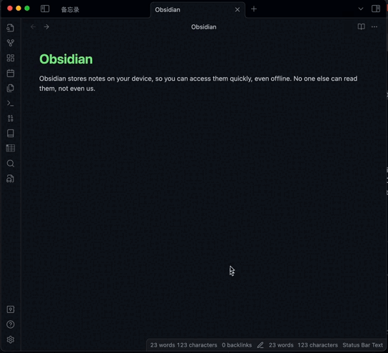

This is a text-to-audio plugin for Obsidian.

## Documents

[Chinese](./README.zh.md) | [English](./README.md)

## Prerequisites

Before you start using this plug-in, you need to [apply for Microsoft's text-to-speech service](https://learn.microsoft.com/en-us/azure/ai-services/speech-service/index-text-to-speech).

## Settings

You can config the plugin by following steps.

- Open **Preferences** in Obsidian.
- In the side menu, click **Text2Audio**.
- Fill in `Speech key`, `Speech Region` and `Directory` content.Among them, you can refer to [this document](https://learn.microsoft.com/en-us/azure/ai-services/multi-service-resource?pivots=azportal&tabs=macos#get-the-keys-for-your-resource) to obtain `Speech key` and `Speech Region`.

## How to use

### Use directly

- Click the `Text to Audio` icon in the left side menu, or click the command icon in the left side menu and select the command named **Text2Audio: Convert text to audio** to open the modal.
- Enter the text and select the language that you wanna convert to.
- Click the play or save button.

### Convert the selected text

This plugin also supports convert the selected text.

### Set hotkeys

You can also set hotkeys for commands.

- Open **Preferences** in Obsidian.
- Click the **Community plugins** in the side menu.
- Click the **Hotkeys icon** next to the information of the **Text2Audio** plugin.
