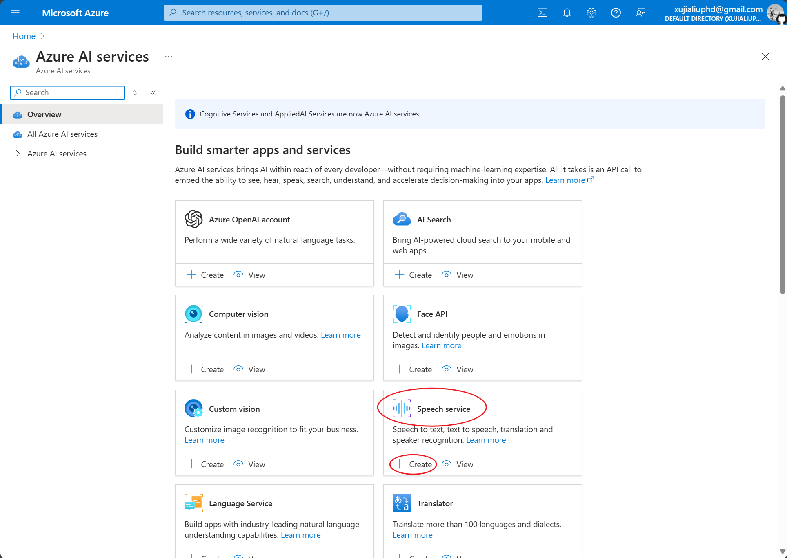
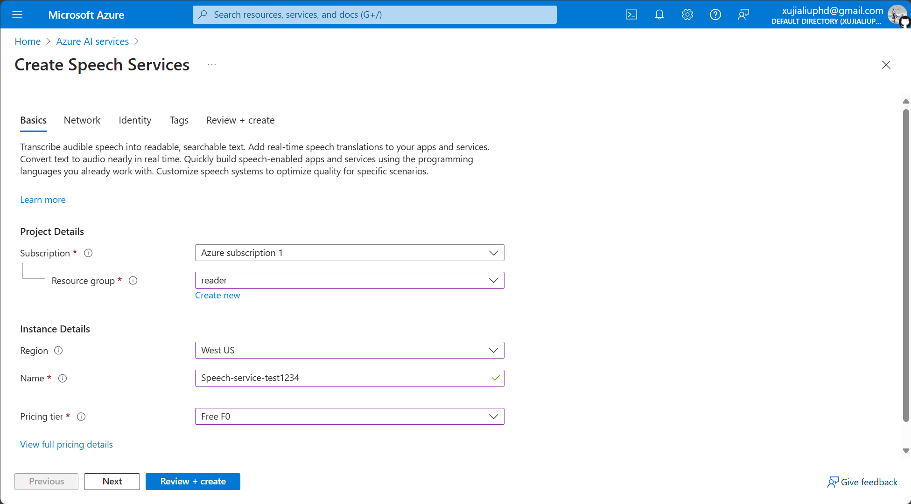
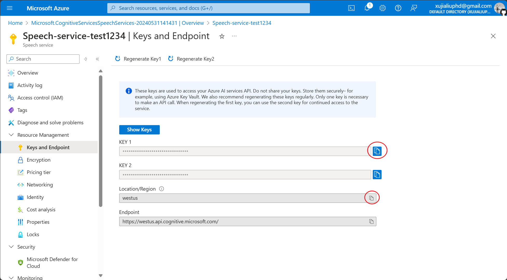

Obsidian Text-to-Audio Plugin

  
  

## Documents

[Simplified Chinese](./README.zh.md) | [Traditional Chinese](./README.zht.md) | [English](./README.md)

## Change Log

[You can view the latest changes here.](./CHANGELOG.md)

## Prerequisites

Before using this plugin, you need to apply for Microsoft's [Text-to-Speech Service](https://learn.microsoft.com/en-us/azure/ai-services/speech-service/index-text-to-speech).

## Installation and Configuration

You can configure the plugin by following the steps below.

### Install the Plugin

- Open **Settings** in Obsidian.
- In the side menu, find **Community Plugins** under **Community plugins**, click **Browse**, search for **Text2Audio**, and install and enable **Text2Audio**.
- Fill in the `Speech key`, `Speech Region`, and `Directory`(optional,). You can refer to [this document](https://learn.microsoft.com/en-us/azure/ai-services/multi-service-resource?pivots=azportal&tabs=macos#get-the-keys-for-your-resource) to get the `Speech key` and `Speech Region`.

### Configure the Plugin

- You can quickly register or log in to **Microsoft Azure Cloud Services** through this [website](https://portal.azure.com/#home).

- After logging in, click on `Azure AI services`.
  
  

  
- Find `Speech service` and click `create` to create a service instance.
  

- Create a `Resource group` (if it's your first time using it), and then choose the Region closest to you.
  

- The `Name` must be unique globally, so please name it longer, note: no spaces or `_` are allowed.
- Choose `Free F0` for Pricing tier.
- Click `Review + create`, then click `Create` after the page transitions.
- Wait a moment for the instance to be created, then click Go to resource.
  

- Click on `Keys and Endpoint` in the left sidebar.
  

- Copy the `KEY` to the `Speech key` field in Obsidian **Text2Audio**, and copy `Location/Region` to the `Speech Region` field.
  

  

- Congratulations, you have completed the setup!

## How to Use

This plugin has two usage methods, using Keyboard Shortcuts or 

### Using Keyboard Shortcuts (**Recommended**)

By setting hotkeys, you can quickly convert text to speech using keyboard shortcuts. The hotkeys and explanations are shown as follows.
- Convert text to speech: Select text or set Read before or after to convert text to speech and play it.
- Pause or resume the audio: Pause/play.
- Stop conversion: Terminate text-to-speech conversion and close the current player process.
- Convert text to audio: Open the plugin window (select text with the mouse, then press the shortcut key, and the selected text will appear in the plugin window input box).
  

### Using the plugin window

-   Click the `Text to Audio` icon in the left side menu, or click the command icon in the left side menu and select the command named **Text2Audio: Convert text to audio** to open the plugin window.
-   Enter the text and select the language that you wanna convert to.
-   Click the play or save button.

## Activity

