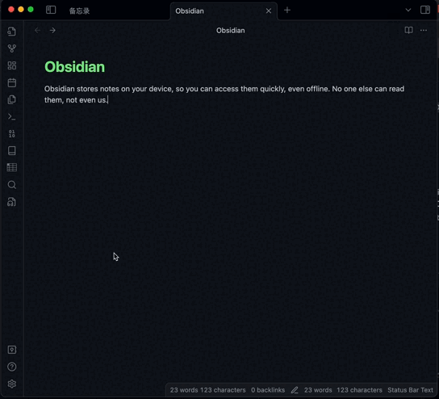

Obsidian 文本转音频插件。

## 文档

[中文文档](./README.zh.md) | [英文文档](./README.md)

## 先决条件

在开始使用此插件之前，您需要事先申请微软的[文本转语音服务](https://learn.microsoft.com/zh-cn/azure/ai-services/speech-service/index-text-to-speech)。

## 配置

您可以按照以下步骤配置插件。

- 在 Obsidian 中打开**首选项**。
- 在侧面菜单中，单击 **Text2Audio**。
- 填写`Speech key`、`Speech Region` 和 `Directory`。其中，`Speech key`、`Speech Region` 的获取方式可以参考[本文档](https://learn.microsoft.com/zh-cn/azure/ai-services/multi-service-resource?pivots=azportal&tabs=macos#get-the-keys-for-your-resource)。

＃＃ 如何使用

### 直接使用

- 单击左侧菜单中的“文本转音频”图标，或单击左侧菜单中的命令图标并选择名为 **Text2Audio: Open t2a modal** 的命令以打开操作界面。
- 输入文本并选择您想要转换成的语言。
- 单击播放或保存按钮。

### 转换选定的文本

该插件还支持转换选定的文本。

### 设置热键

您还可以为命令设置热键。

- 在 Obsidian 中打开**首选项**。
- 单击侧面菜单中的 **社区插件**。
- 单击 **Text2Audio** 插件信息旁边的 **热键图标** 进行设置。
