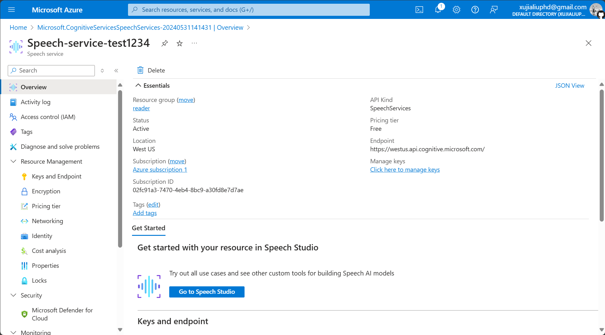

Obsidian 文本转音频插件。

  
  

## 文档

[简中文档](./README.zh.md) | [繁中文档](./README.zht.md) | [英文文档](./README.md)

## 变更日志

[您可以在这里查看最近的变更。](./CHANGELOG.md)

## 先决条件

在开始使用此插件之前，您需要事先申请微软的[文本转语音服务](https://learn.microsoft.com/zh-cn/azure/ai-services/speech-service/index-text-to-speech)。

## 安装和配置

您可以按照以下步骤配置插件。

### 安装插件

- 在 Obsidian 中打开**设置**。
- 在侧面菜单的**第三方插件**中找到**社区插件市场**，点击**浏览**，搜索**Text2Audio**，并安装和启用**Text2Audio**。

- 填写 `Speech key`、`Speech Region` 和 `Directory`。其中，`Speech key`、`Speech Region` 的获取方式可以参考[本文档](https://learn.microsoft.com/zh-cn/azure/ai-services/multi-service-resource?pivots=azportal&tabs=macos#get-the-keys-for-your-resource)。

### 配置插件
- 您可以通过这个[网址](https://portal.azure.com/#home)快速注册或登录**微软Azure云服务**。

- 登录后，点击 `Azure AI services`。
  

  
- 找到 `Speech service` 后点击 `create`，创建一个服务实例。
  

  
- 创建一个 `Resource group`（如果是第一次使用），然后选择离您最近的 `Region`。
  

  
- `Name` 规定全网不能重复，所以请命名长一些，注意：不能有空格或 ` _` 等。

- `Pricing tier` 选择 `Free F0` 即可。

- 点击 `Review + create`，页面跳转后点击 `Create`。

- 稍等一会儿等待实例创建，点击 `Go to resource`。
  

  
- 点击左侧侧边栏的 `Keys and Endpoint`。
  

  
- 复制 `KEY` 到 Obsidian **Text2Audio** 的 `Speech key`，复制 `Location/Region` 到 `Speech Region`。
  

  

  
- 恭喜你，完成设置！
## 如何使用
该插件有2种使用方式：使用热键和直接使用。

### 使用热键 (**推荐用法**)

- Convert text to speech: 选中文本或通过设置 Read before or after，将文本转换成语音并播放。
- Pause or resume the audio: 暂停/播放。
- Stop conversion: 终止文本转语音并关闭当前播放器进程。
- 通过设置热键，使用快捷键快速将文本转换成语音，可自定义快捷键和解释如下。
- Convert text to audio: 打开插件输入框窗口（鼠标选中文本，再按下快捷键将，选中的文本将出现在插件窗口的输入框中）。
  

### 通过插件窗口

- 单击左侧菜单中的“文本转音频”图标，或单击左侧菜单中的命令图标并选择名为 **Text2Audio: Convert text to audio** 的命令以打开插件窗口。
- 输入文本并选择您想要转换成的语言。
- 单击播放或保存按钮。

## 活动

