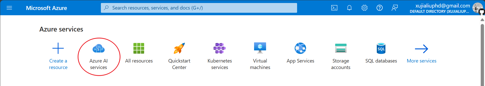
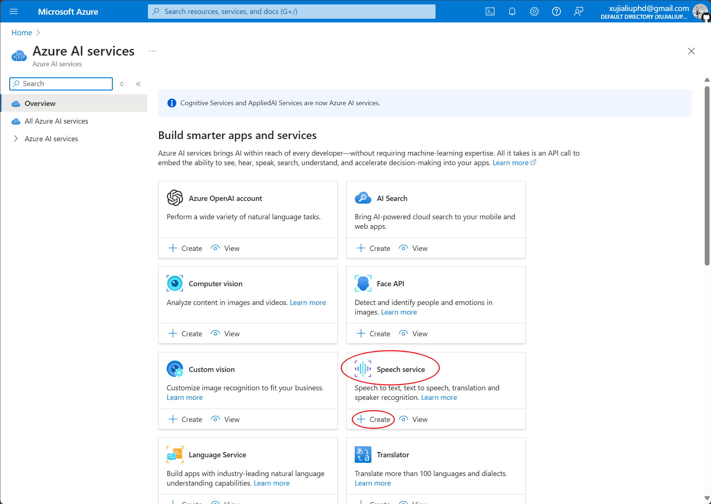
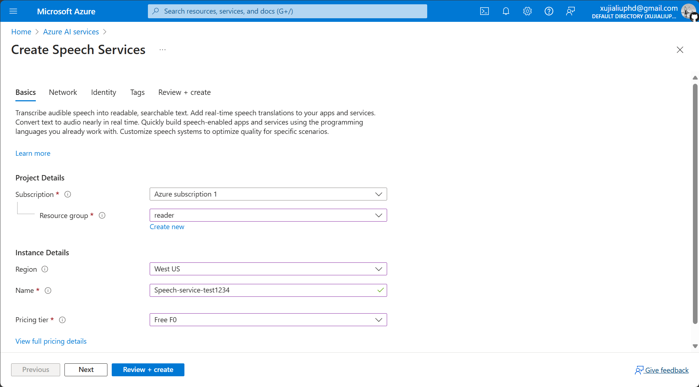
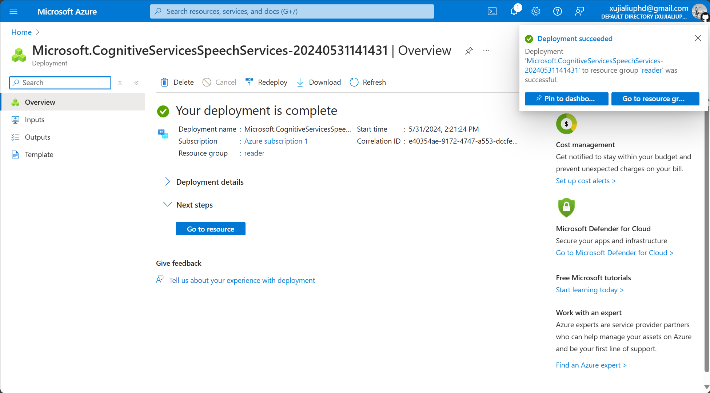
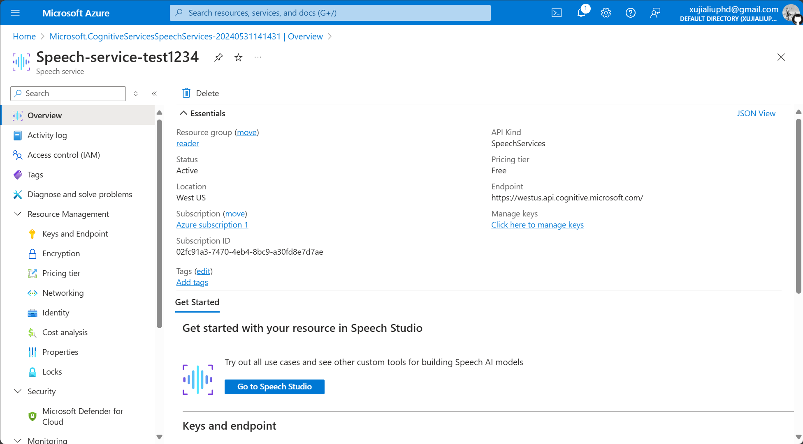
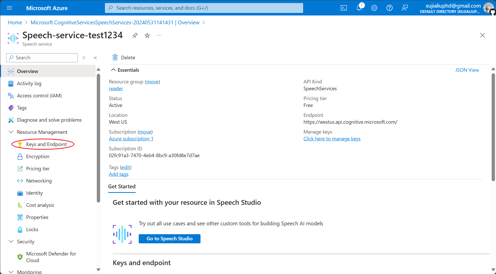
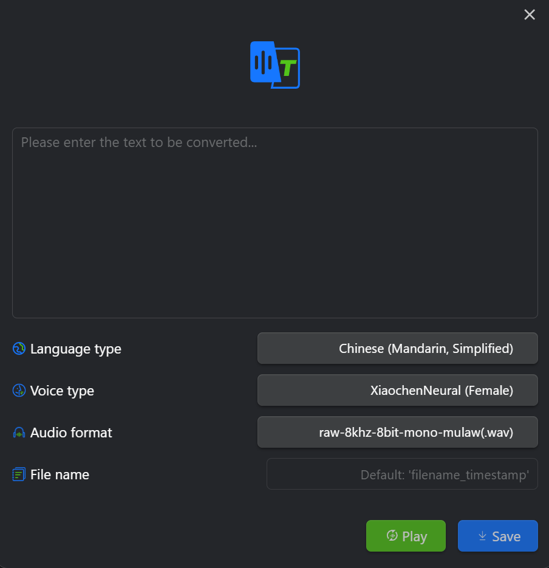
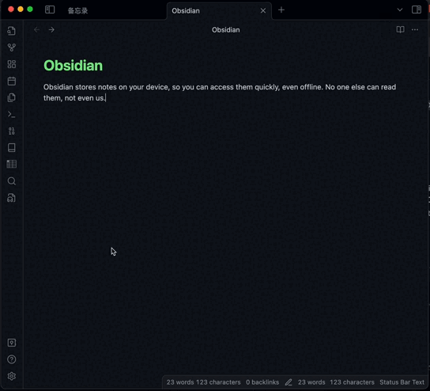

Obsidian 文本轉音頻插件。

  
  

## 文檔

[簡中文檔](./README.zh.md) | [繁中文檔](./README.zht.md) | [英文文檔](./README.md)

## 變更日誌

[您可以在這裡查看最近的變更。](./CHANGELOG.md)

## 先決條件

在開始使用此插件之前，您需要事先申請微軟的[文本轉語音服務](https://learn.microsoft.com/zh-tw/azure/ai-services/speech-service/index-text-to-speech)。

## 安裝和配置

您可以按照以下步驟配置插件。

### 安裝插件

- 在 Obsidian 中打開**設置**。
- 在側面菜單的**第三方插件**中找到**社區插件市場**，點擊**瀏覽**，搜索**Text2Audio**，並安裝和啟用**Text2Audio**。
- 填寫 `Speech key`、`Speech Region` 和 `Directory`。其中，`Speech key`、`Speech Region` 的獲取方式可以參考[本文檔](https://learn.microsoft.com/zh-tw/azure/ai-services/multi-service-resource?pivots=azportal&tabs=macos#get-the-keys-for-your-resource)。

### 配置插件
- 您可以通過這個[網址](https://portal.azure.com/#home)快速註冊或登錄**微軟Azure雲服務**。

- 登錄後，點擊 `Azure AI services`。
  

  
- 找到 `Speech service` 後點擊 `create`，創建一個服務實例。
  

  
- 創建一個 `Resource group`（如果是第一次使用），然後選擇離您最近的 `Region`。
  

  
- `Name` 規定全網不能重複，所以請命名長一些，注意：不能有空格或 ` _` 等。

- `Pricing tier` 選擇 `Free F0` 即可。

- 點擊 `Review + create`，頁面跳轉後點擊 `Create`。

- 稍等一會兒等待實例創建，點擊 `Go to resource`。
  

  
- 點擊左側側邊欄的 `Keys and Endpoint`。
  

  
- 複製 `KEY` 到 Obsidian **Text2Audio** 的 `Speech key`，複製 `Location/Region` 到 `Speech Region`。
  

  

  
- 恭喜你，完成設置！

## 如何使用
該插件有2種使用方式：使用熱鍵和直接使用。

### 使用熱鍵 (**推薦用法**)

- Convert text to speech: 選中文本或通過設置 Read before or after，將文本轉換成語音並播放。
- Pause or resume the audio: 暫停/播放。
- Stop conversion: 終止文本轉語音並關閉當前播放器進程。
- 通過設置熱鍵，使用快捷鍵快速將文本轉換成語音，可自定義快捷鍵和解釋如下。
- Convert text to audio: 打開插件輸入框窗口（滑鼠選中文本，再按下快捷鍵將，選中的文本將出現在插件窗口的輸入框中）。
  

### 通過插件窗口

- 單擊左側菜單中的“文本轉音頻”圖標，或單擊左側菜單中的命令圖標並選擇名為 **Text2Audio: Convert text to audio** 的命令以打開插件窗口。
- 輸入文本並選擇您想要轉換成的語言。
- 單擊播放或保存按鈕。

